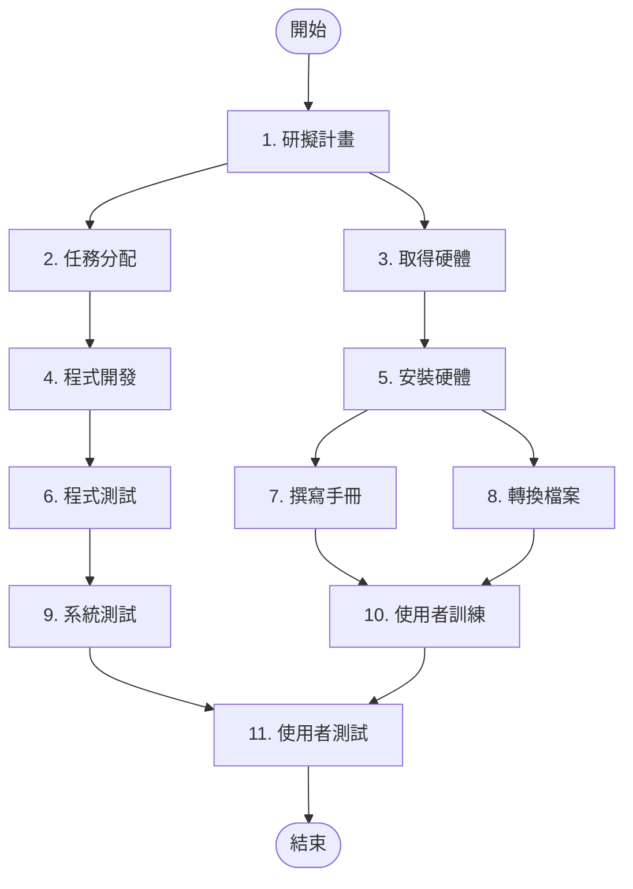
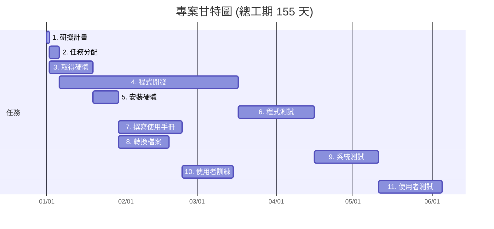

## 1. 任務及任務模式

| 任務 | 說明 | 工期 | 前置任務 |
|---|---|---:|---|
| 1 | 研擬計畫 | 1 天 | - |
| 2 | 任務分配 | 4 天 | 1 |
| 3 | 取得硬體 | 17 天 | 1 |
| 4 | 程式開發 | 70 天 | 2 |
| 5 | 安裝硬體 | 10 天 | 3 |
| 6 | 程式測試 | 30 天 | 4 |
| 7 | 撰寫使用手冊 | 25 天 | 5 |
| 8 | 轉換檔案 | 20 天 | 5 |
| 9 | 系統測試 | 25 天 | 6 |
| 10 | 使用者訓練 | 20 天 | 7, 8 |
| 11 | 使用者測試 | 25 天 | 9, 10 |

## 2. PERT/CPM 圖

## 3. 開始及結束時間

| 任務 | 說明 | 工期 | 開始 | 結束 |
|---|---|---:|---:|---:|
| 1 | 研擬計畫 | 1 天 | Day 1 | Day 1 |
| 2 | 任務分配 | 4 天 | Day 2 | Day 5 |
| 3 | 取得硬體 | 17 天 | Day 2 | Day 18 |
| 4 | 程式開發 | 70 天 | Day 6 | Day 75 |
| 5 | 安裝硬體 | 10 天 | Day 19 | Day 28 |
| 6 | 程式測試 | 30 天 | Day 76 | Day 105 |
| 7 | 撰寫使用手冊 | 25 天 | Day 29 | Day 53 |
| 8 | 轉換檔案 | 20 天 | Day 29 | Day 48 |
| 9 | 系統測試 | 25 天 | Day 106 | Day 130 |
| 10 | 使用者訓練 | 20 天 | Day 54 | Day 73 |
| 11 | 使用者測試 | 25 天 | Day 131 | Day 155 |

## 4. 甘特圖

## 5. 關鍵路徑

**1 → 2 → 4 → 6 → 9 → 11**

關鍵路徑總工期：

**1 + 4 + 70 + 30 + 25 + 25 = 155 天**

因此：

**專案總工期 = 155 天**
